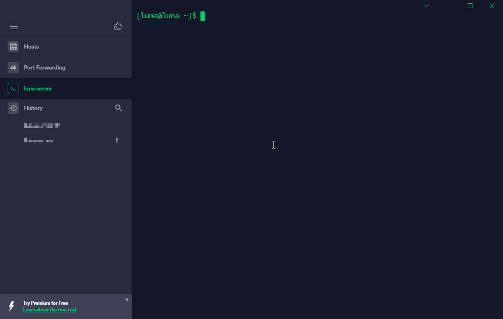

# Customised Linux Banner and MOTD Messages
Examples on implementing your own custom welcome (or warning) message when a user remotely accesses a Linux system.

## See It In Action

## Notes (Centos 7)
* To display a banner message before the password login prompt edit the `issue.net` file located in the `/etc` directory
* If you want to display a simple plaintext message, you can edit the `motd` file located in the `/etc` directory 

## Useful Extras
* [Text to ASCII art generator](https://bit.ly/2BsGXe5)

## Credits
1. [Customize your Login Screen via Linux's Message of the Day (Ubuntu/CentOS)](https://bit.ly/3dwBYXV) *by Fideloper LLC* 
2. [Protect SSH Logins with SSH & MOTD Banner Messages](https://bit.ly/36UURBw) *by Ravi Saive*